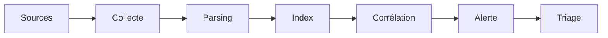

# SIEM & Monitoring

## Objectif

Comprendre comment un SIEM collecte, normalise, corrèle et alerte, et savoir construire un use case de détection.

## Concepts

- **Pipeline** : sources → collecte (agents, syslog) → parsing/normalisation → stockage → corrélation → alerte → ticket.
- **Use case** : scénario de menace + sources de logs + logique + seuil + réponse.
- **Faux positifs / négatifs** : tuning par allow-list, seuils, enrichissement.
- **Niveaux SOC** : L1 (triage), L2 (investigation), L3 (hunting, engineering).

## Requêtes

_À compléter avec tes requêtes de lab._

## Mapping ATT&CK

| Technique | Source de logs | Détection |
|---|---|---|
| | | |

## Lab

- [ ] Déployer un SIEM (voir [home lab](../labs/home-lab.md))
- [ ] Écrire un use case brute force

## À retenir

- Une bonne alerte est **actionnable** et documentée (runbook).
