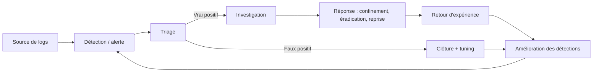
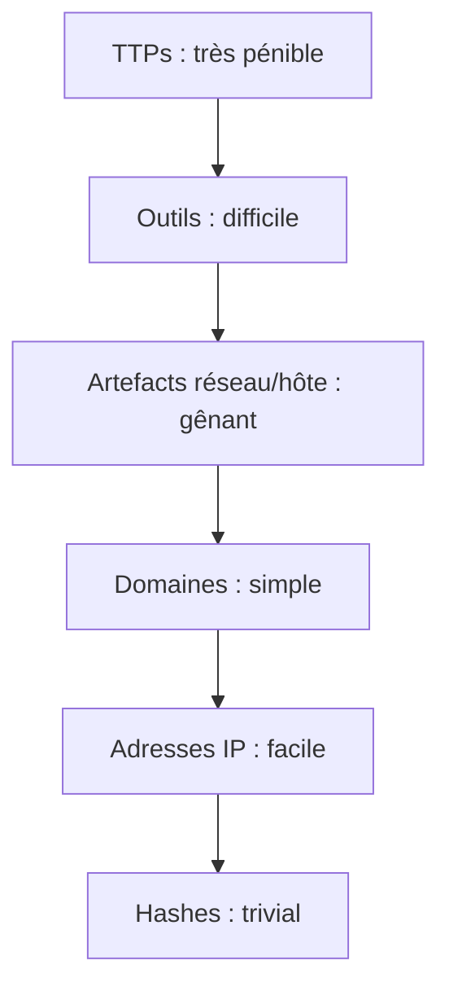

# 1. Le SOC

## Mission

Un **Security Operations Center** surveille en continu les systèmes d'information pour **détecter, analyser et répondre** aux menaces. Il repose sur trois piliers :

| Pilier | Contenu |
|---|---|
| **Personnes** | Analystes, ingénieurs de détection, threat hunters, responsables |
| **Processus** | Triage, escalade, réponse à incident, amélioration continue |
| **Technologie** | SIEM, EDR, NDR, SOAR, renseignement sur la menace |

Le SOC ne **prévient** pas les attaques en première ligne (c'est le rôle du durcissement, des correctifs, de l'architecture) : il part du principe qu'une intrusion finira par réussir et réduit le **temps pendant lequel l'adversaire reste invisible**.

## Rôles

Le modèle classique est organisé en niveaux (*tiers*) :

| Niveau | Rôle | Tâches typiques |
|---|---|---|
| **L1** | Analyste de triage | Surveille la file d'alertes, qualifie (vrai/faux positif), enrichit, escalade ou clôt |
| **L2** | Analyste investigation / IR | Investigue en profondeur, détermine le périmètre, coordonne le confinement |
| **L3** | Expert / hunter / ingénieur | Threat hunting, ingénierie de détection, analyse de malware, forensics avancée |
| **Management** | Responsable SOC | Priorités, métriques, relations avec le métier |
| **CTI** | Renseignement sur la menace | Profils d'adversaires, IOC, rapports de menace |

!!! note "Le modèle en tiers n'est pas universel"
    Beaucoup de SOC modernes sont **plats** : tous les analystes investiguent de bout en bout, et une équipe de *detection engineering* maintient les règles. Retiens les **fonctions** (triage, investigation, hunting, ingénierie) plus que les étiquettes L1/L2/L3.

## Le processus de bout en bout

Chaque flèche de retour compte : **un SOC qui ne réinjecte pas ses leçons dans ses détections stagne.**

## Les outils

| Outil | Rôle | Ce qu'il voit |
|---|---|---|
| **SIEM** | Collecte, corrèle et alerte à partir de logs de **sources multiples** | Tout ce qui est journalisé |
| **EDR / XDR** | Télémétrie et réponse **sur les postes/serveurs** (processus, fichiers, réseau local) | Comportement détaillé d'un hôte |
| **NDR / IDS** | Analyse du trafic réseau | Flux, protocoles, signatures |
| **SOAR** | **Orchestre et automatise** la réponse via des playbooks | Les alertes qu'on lui confie |
| **TIP** | Gère le renseignement sur la menace (IOC, TTP) | Flux de CTI |
| **Ticketing** | Trace chaque incident (qui, quand, quoi) | Le cycle de vie des cas |

!!! tip "SIEM vs EDR : ne les confonds pas"
    L'EDR a une vue **profonde mais locale** (un hôte). Le SIEM a une vue **large mais plus superficielle** (beaucoup de sources). Les deux se complètent : le SIEM corrèle un login VPN, une alerte EDR et une requête DNS suspecte qu'aucun outil ne verrait seul.

## Modèles de référence

### Cyber Kill Chain (Lockheed Martin)

Sept étapes linéaires : reconnaissance, armement, livraison, exploitation, installation, commande et contrôle, actions sur objectifs. Utile pour raisonner « où couper la chaîne », mais trop linéaire pour les attaques modernes.

### MITRE ATT&CK

Base de connaissances des **comportements réels** d'adversaires : tactiques (le *pourquoi*), techniques (le *comment*). C'est le **langage commun** pour décrire, détecter et mesurer. Voir le [parcours MAD](../../mad/index.md).

### Pyramid of Pain (David Bianco)

Classe les indicateurs selon la **difficulté pour l'adversaire de les changer** :

Détecter un **hash** est facile mais l'adversaire le change en recompilant. Détecter un **comportement** (une technique) oblige l'adversaire à changer sa façon de travailler : c'est là que la détection a le plus de valeur.

## Pour vérifier

??? question "Pourquoi un SOC a-t-il besoin à la fois d'un SIEM et d'un EDR ?"
    Le SIEM offre la **vue transversale** (corrélation entre sources), l'EDR la **profondeur sur l'hôte** (arbre de processus, mémoire, réponse). Aucun des deux ne remplace l'autre.

??? question "Quelle détection est la plus robuste face à un adversaire adaptatif : un hash de malware ou une technique comportementale ?"
    La technique comportementale (haut de la Pyramid of Pain). Un hash change à chaque recompilation.

## À retenir

- Le SOC réduit le **temps d'invisibilité** de l'adversaire ; il ne remplace pas la prévention.
- Retiens les **fonctions** (triage, investigation, hunting, ingénierie), pas seulement les niveaux.
- SIEM = **largeur**, EDR = **profondeur**, SOAR = **automatisation**.
- Vise les **TTPs** plutôt que les IOC fragiles.

## Pour aller plus loin

- *Pyramid of Pain*, David Bianco (article de blog).
- Site MITRE ATT&CK, section *Getting Started*.
