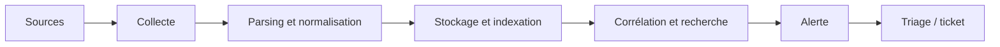

# 2. Architecture d'un SIEM

## Le pipeline



Une alerte n'est fiable que si **chaque maillon** l'est. Un parsing cassé ou une source silencieuse produit des détections aveugles, sans aucune erreur visible.

## 1. Les sources de logs

Une détection n'existe que si la **donnée nécessaire est collectée**. Pense en familles :

| Famille | Exemples de sources | Ce qu'elles révèlent |
|---|---|---|
| **Endpoint** | Journaux Windows (Security, PowerShell), Sysmon, auditd, EDR | Processus, authentifications, persistance |
| **Identité** | Active Directory / contrôleurs de domaine, Entra ID, SSO, VPN | Qui se connecte, d'où, avec quels privilèges |
| **Réseau** | Pare-feu, proxy, DNS, Zeek, Suricata, NetFlow | Communications, C2, exfiltration |
| **Applications** | Serveur web, base de données, messagerie | Exploitation applicative, accès aux données |
| **Cloud** | CloudTrail (AWS), Activity Log (Azure), Audit (GCP), M365 | Actions sur les ressources et identités cloud |
| **Outils de sécurité** | Antivirus, EDR, WAF, scanners de vulnérabilités | Alertes déjà produites ailleurs |

!!! tip "Raisonne en « quelle donnée prouve cette technique ? »"
    Pour détecter Kerberoasting (T1558.003) il te faut les événements **4769** des contrôleurs de domaine. Sans ces logs, aucune règle, même parfaite, ne fonctionne. Cette démarche (technique → *data source* → source de logs) est au cœur d'ATT&CK.

## 2. La collecte

| Méthode | Principe | Atouts | Limites |
|---|---|---|---|
| **Agent** (Elastic Agent/Beats, Splunk Universal Forwarder, NXLog) | Logiciel sur l'hôte qui lit et envoie | Tampon local en cas de coupure, filtrage/enrichissement à la source, transport sécurisé | À déployer et maintenir sur chaque hôte |
| **Syslog** | Les équipements envoient vers un collecteur | Universel (réseau, Linux) | UDP : aucune garantie de livraison, pas de chiffrement |
| **Windows Event Forwarding** | Les hôtes poussent leurs événements vers un collecteur Windows | Natif, sans agent tiers | Configuration GPO, volumétrie |
| **API / pull** | Le SIEM interroge un service (cloud, SaaS) | Seule option pour beaucoup de SaaS | Quotas, latence, jetons à renouveler |
| **Bus de messages** (Kafka) | Tampon entre collecte et SIEM | Absorbe les pics, découple | Infrastructure supplémentaire |

!!! warning "Syslog en UDP"
    UDP 514 n'assure ni accusé de réception ni chiffrement : en cas de saturation, **des logs disparaissent sans aucune alerte**. Préfère TCP, voire TLS (souvent le port 6514).

## 3. Parsing et normalisation

Un log brut est du texte. Le **parsing** en extrait des champs (`src_ip`, `user`, `process`). La **normalisation** les nomme de façon **cohérente entre sources**.

| Schéma | Écosystème |
|---|---|
| **ECS** (Elastic Common Schema) | Elastic |
| **CIM** (Common Information Model) | Splunk |
| **ASIM** | Microsoft Sentinel |
| **OCSF** | Standard ouvert, soutenu par plusieurs éditeurs |

Pourquoi c'est vital : avec un schéma commun, **une seule requête** (`source.ip : 10.1.2.3`) interroge pare-feu, proxy et VPN ; sans lui, il faut une requête par format.

### Quand extrait-on les champs ?

| Approche | Principe | Exemple |
|---|---|---|
| **Schema-on-read** | Les logs sont stockés bruts, les champs sont extraits **à la recherche** | Splunk (majoritairement) |
| **Schema-on-write** | Les champs sont extraits **à l'ingestion** selon un mapping | Elastic (majoritairement) |

Conséquences : schema-on-read est **flexible** (on peut redéfinir une extraction a posteriori) mais plus coûteux à la recherche ; schema-on-write est **rapide à interroger** mais une erreur de mapping est difficile à corriger sur des données déjà indexées.

### Le piège du temps

Corréler des événements suppose des **horloges fiables**. Surveille :

- la **synchronisation NTP** de toutes les sources ;
- le **fuseau horaire** : stocke et corrèle en UTC ;
- l'écart entre l'**heure de l'événement** et l'**heure d'ingestion** (retard de collecte). Une règle sur « les 5 dernières minutes » rate les événements arrivés en retard.

## 4. Stockage et rétention

| Niveau | Contenu | Usage |
|---|---|---|
| **Hot** | Données récentes, stockage rapide | Détection en temps réel, investigation |
| **Warm** | Données plus anciennes, moins sollicitées | Investigation de quelques semaines |
| **Cold / archive** | Stockage peu coûteux | Conformité, enquêtes longues |

La rétention est un arbitrage **coût / capacité d'enquête**. Une intrusion est souvent découverte des semaines ou mois après l'accès initial : une rétention trop courte rend l'enquête impossible. Le volume se mesure en **EPS** (événements par seconde) ou en **Go/jour** ; il pilote le dimensionnement et, avec certains éditeurs, la licence.

## 5. Corrélation et alerte

Le moteur évalue des règles sur les données entrantes (en continu) ou planifiées (toutes les N minutes). Les types de logique sont détaillés au [chapitre 3](03-use-cases.md).

## 6. La qualité des données : le sujet qu'on oublie

!!! danger "Une source silencieuse est une alerte qui ne se déclenchera jamais"
    Si un contrôleur de domaine cesse d'envoyer ses logs, **toutes** les détections AD sont aveugles, et rien ne l'indique.

Mets en place une **surveillance de la santé des sources**. Exemple SPL pour repérer les hôtes silencieux depuis plus d'une heure :

```spl
| tstats latest(_time) as last_seen where index=* by host
| eval minutes_silent = round((now() - last_seen) / 60)
| where minutes_silent > 60
| sort - minutes_silent
```

Autres contrôles : volume par source comparé à la normale, taux d'erreurs de parsing, champs critiques vides (`user`, `src_ip`).

## 7. Deux piles à connaître

| Composant | Elastic Stack | Splunk |
|---|---|---|
| Collecte | Elastic Agent, Beats | Universal / Heavy Forwarder |
| Transformation | Logstash, ingest pipelines | Props/transforms, heavy forwarder |
| Stockage / recherche | Elasticsearch | Indexers |
| Interface | Kibana (Discover, Security, Lens) | Search Head |
| Langage de recherche | KQL, EQL, ES\|QL | SPL |

## Pour vérifier

??? question "Tu veux détecter du DCSync (T1003.006). De quelle source as-tu besoin ?"
    Des journaux de sécurité des **contrôleurs de domaine**, événement **4662** (opération sur objet AD) avec l'audit des accès au service d'annuaire activé. Sans cette source et sans cet audit, aucune règle ne peut fonctionner.

??? question "Pourquoi stocker en UTC ?"
    Pour corréler des sources situées dans des fuseaux différents sans erreur de décalage, et éviter les ambiguïtés lors des changements d'heure.

## À retenir

- **Pas de donnée, pas de détection** : pars de la technique pour trouver la source de logs.
- Agent > syslog UDP en fiabilité ; **TCP/TLS** quand l'agent n'est pas possible.
- Un **schéma commun** (ECS, CIM…) rend les requêtes réutilisables.
- Surveille la **santé des sources** : le silence est un risque.
- Horloges, UTC, délai d'ingestion : trois sources d'erreurs de corrélation.

## Pour aller plus loin

- Documentation ECS et CIM : lis la liste des champs de `process`, `source`, `user`.
- Matrice *data sources* d'ATT&CK.
