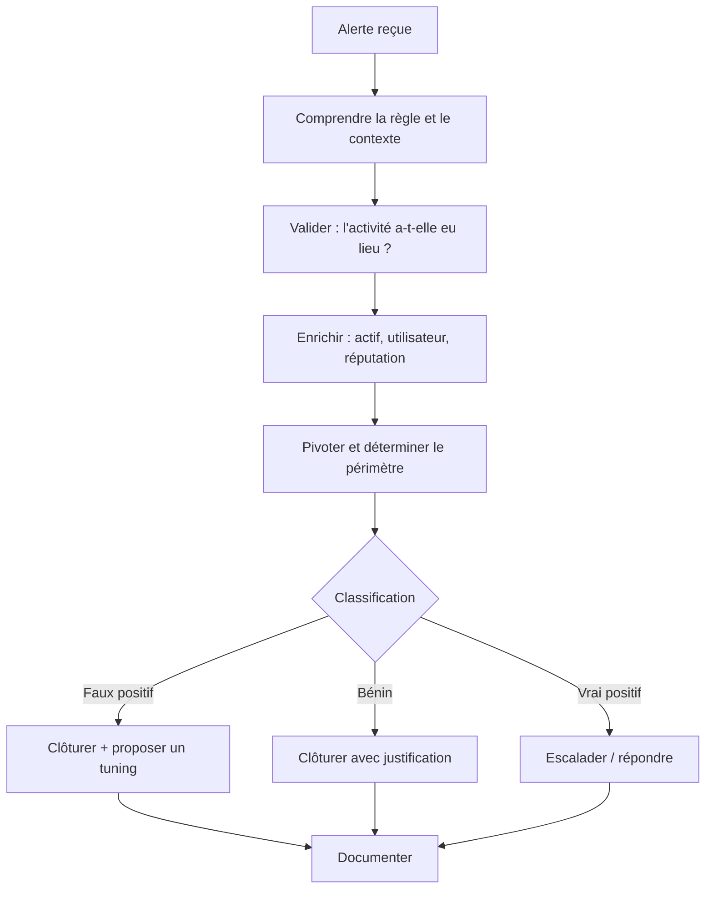

# 4. Triage & investigation

## Le workflow



## Les cinq questions

À chaque alerte, réponds dans l'ordre :

1. **Que s'est-il passé ?** (événement, heure, hôte, utilisateur, processus)
2. **Est-ce réel ?** (la donnée est-elle fiable, l'activité a-t-elle vraiment eu lieu ?)
3. **Est-ce malveillant ?** (légitime, suspect, confirmé)
4. **Quel est le périmètre ?** (un hôte, plusieurs, un compte, des données touchées)
5. **Que faire ensuite ?** (clore, surveiller, escalader, contenir)

## Classer le résultat

| Classification | Sens | Exemple |
|---|---|---|
| **Vrai positif** | Activité malveillante réelle | Connexion d'un attaquant avec un compte volé |
| **Vrai positif bénin** | La règle a bien détecté, mais l'activité est **autorisée** | Un administrateur lance un scan planifié |
| **Faux positif** | La règle se déclenche à tort | Règle trop large ou donnée mal parsée |
| **Faux négatif** | Une attaque réelle **non détectée** | À découvrir via hunting ou incident |

!!! note "Pourquoi distinguer « vrai positif bénin » du faux positif ?"
    Un **faux positif** pointe vers une règle à corriger. Un **vrai positif bénin** montre une règle correcte mais une activité légitime qu'on peut documenter ou exclure par contexte. Le traitement de tuning diffère.

## Enrichir

| Besoin | Sources |
|---|---|
| Qui est cet utilisateur ? | Annuaire, RH, groupes, historique de connexions |
| Quel est cet hôte ? | CMDB / inventaire : propriétaire, rôle, criticité, correctifs |
| Cette IP ou ce domaine ? | Géolocalisation, WHOIS, réputation, DNS passif |
| Ce fichier ? | Hash, signature, réputation, sandbox |
| Est-ce déjà arrivé ? | Historique de l'alerte, tickets précédents |

!!! warning "Attention à ce que tu envoies à l'extérieur"
    Les services publics (VirusTotal et similaires) **partagent** ce que tu soumets. N'envoie jamais de fichiers ou de données internes sensibles ; privilégie le **hash** ou une sandbox interne.

## Pivoter

Pivoter, c'est passer d'un élément à un autre pour élargir la compréhension.

| Point de départ | Pivots possibles |
|---|---|
| Processus suspect | Processus parent → ligne de commande → utilisateur → hôte |
| Utilisateur | Autres hôtes de connexion, horaires, IP sources |
| IP source | Autres comptes visés, autres hôtes contactés |
| Fichier / hash | Autres hôtes où il apparaît |
| Domaine | Toutes les requêtes DNS, hôtes concernés |

## Cas pratique : « 4625 en rafale »

### L'alerte

> **Règle** : plus de 20 échecs 4625 depuis une même IP en 5 min · **Source** : `203.0.113.45` · **Cible** : serveur `SRV-FILE01`

### Raisonnement

1. **Compréhension** : 4625 = échec de connexion. L'IP est externe (plage de documentation `203.0.113.0/24`, fictive ici).
2. **Validation** : on lit les événements bruts. 140 échecs en 4 min, sur 6 comptes (`admin`, `backup`, `svc_sql`, `jsmith`, …). Plusieurs comptes → **spraying probable**.
3. **Enrichissement** : `SRV-FILE01` est un serveur de fichiers, exposé via RDP. L'IP n'appartient à aucune liste connue.
4. **Pivot : y a-t-il eu un succès ?** On cherche les 4624 pour cette IP :

```spl
index=wineventlog EventCode=4624 src_ip="203.0.113.45"
| table _time, user, host, Logon_Type
```

   Résultat : un **4624 de type 10 (RDP)** pour `backup`, 90 secondes après la dernière rafale d'échecs.
5. **Périmètre** : que fait `backup` depuis cette connexion ? On pivote sur la session :

```spl
index=wineventlog host="SRV-FILE01" user="backup" earliest=-1h
| sort _time
| table _time, EventCode, New_Process_Name, Process_Command_Line
```

   On trouve `whoami`, `net group "Domain Admins" /domain`, puis un téléchargement d'outil.

### Conclusion

**Vrai positif, compromission de compte confirmée** (accès initial par password spraying sur RDP exposé, puis découverte T1087/T1033). → **Escalade immédiate** : contenir l'hôte, réinitialiser le compte, chercher d'autres hôtes touchés par `backup`, fermer l'exposition RDP.

!!! success "Ce que ce cas illustre"
    L'alerte initiale seule (« 20 échecs ») n'a rien de grave. C'est la **corrélation avec un succès** puis le **pivot sur l'activité post-connexion** qui change la sévérité. Ne t'arrête pas à l'alerte.

## Quand escalader

Escalade sans attendre si :

- un **compte privilégié** est compromis ou soupçonné ;
- l'activité **se propage** à plusieurs hôtes ;
- de l'**exfiltration** ou du **chiffrement de données** est suspecté ;
- un **actif critique** est touché ;
- tu n'arrives pas à trancher et le risque est élevé : **mieux vaut escalader trop tôt que trop tard**.

## Les biais de l'analyste

| Biais | Effet | Parade |
|---|---|---|
| **Ancrage** | Se fixer sur la première hypothèse | Formuler au moins une hypothèse alternative |
| **Confirmation** | Ne chercher que ce qui valide son idée | Chercher activement ce qui la **contredit** |
| **Clôture prématurée** | Fermer vite parce que la file est longue | Checklist de validation avant clôture |
| **Fatigue d'alerte** | Banaliser les alertes répétitives | Tuning, rotation des tâches |

## Documenter

Une bonne note de clôture contient : **résumé** (1-2 phrases), **chronologie** (UTC), **preuves** (requêtes, captures), **classification** et **justification**, **actions** menées, **recommandations** (tuning, correctif).

```markdown
**Résumé** : Password spraying RDP depuis 203.0.113.45 → compromission du compte `backup` sur SRV-FILE01.
**Chronologie (UTC)** : 09:12 début des échecs · 09:16 succès 4624 type 10 · 09:18 commandes de découverte.
**Classification** : Vrai positif, compromission confirmée.
**Actions** : escalade IR, hôte isolé, compte désactivé.
**Recommandations** : fermer RDP exposé, MFA, alerter sur « échecs puis succès ».
```

## Pour vérifier

??? question "Une alerte de 25 échecs 4625 depuis une IP externe : pourquoi chercher des 4624 avant de classer ?"
    Parce que la gravité dépend de l'**issue** : si un succès suit, le compte est probablement compromis. Sans ce pivot, tu sous-estimes l'incident.

??? question "Quelle différence entre faux positif et vrai positif bénin ?"
    Le faux positif est une alerte **à tort** (règle à corriger). Le vrai positif bénin est une détection **juste** d'une activité **autorisée** (contexte ou exclusion à documenter).

## À retenir

- Cinq questions : **quoi, réel, malveillant, périmètre, suite**.
- **Pivote** : l'alerte est un point de départ, pas la conclusion.
- Enrichis sans fuiter de données internes.
- Combats tes biais : cherche ce qui **contredit** ton hypothèse.
- Documente **pendant**, pas après.

## Pour aller plus loin

- Rejoue ce cas dans ton lab (voir [labs](06-labs.md), lab 5).
- Prépare un modèle de note de clôture dans ton outil de ticketing.
