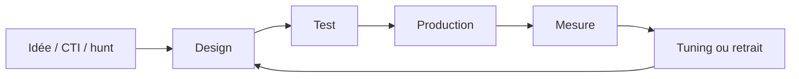

# Cycle de vie d'une détection

| Étape | Livrable |
|---|---|
| Idée | Technique ATT&CK, menace pertinente |
| Design | Règle Sigma, sources de logs requises |
| Test | Atomic Red Team + trafic bénin |
| Production | PR relue, déployée, runbook associé |
| Mesure | Volume, faux positifs, MTTD |
| Retrait | Règle obsolète archivée avec justification |

## Critères de qualité

- Précision (peu de FP), rappel (peu de FN), robustesse (évasion difficile), actionnabilité (runbook).
