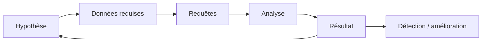

# Méthodologie de hunt

1. **Hypothèse** : « Si un adversaire utilise T…, on verra … dans … ».
2. **Données** : sources disponibles, rétention, qualité.
3. **Requêtes** : large puis affinée ; baseline pour distinguer le normal.
4. **Analyse** : stack counting, fréquence, rareté, pivots.
5. **Résultat** : vrai positif → IR ; faux positif → tuning ; rien → documenter la couverture.
6. **Industrialiser** : transformer le hunt en règle ([lifecycle](../detection-engineering/lifecycle.md)).

Template de hunt : voir [templates](../resources/templates.md) et `hunts/TEMPLATE.md`.
