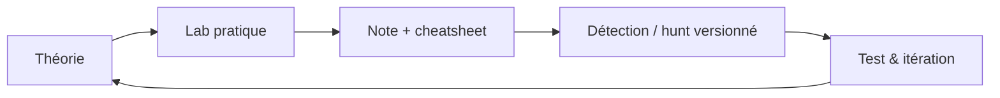

# SOC Lab

Base de connaissances pour préparer **HTB CDSA** et **MITRE ATT&CK Defender**, et monter en compétence en **Threat Hunting** et **Detection Engineering**.

- :material-calendar-check: **[Plan d'étude](study-plan/index.md)** — 12 semaines, suivi de progression
- :material-shield-search: **[HTB CDSA](cdsa/index.md)** — modules, examen, notes
- :material-target: **[MITRE ATT&CK Defender](mad/index.md)** — les 5 badges MAD
- :material-magnify-scan: **[Threat Hunting](hunting/index.md)** — méthodo et hypothèses
- :material-code-braces: **[Detection Engineering](detection-engineering/index.md)** — Sigma, cycle de vie, tests
- :material-file-document-multiple: **[Cheatsheets](cheatsheets/index.md)** — SPL, KQL, Event IDs, Sysmon…
- :material-flask: **[Labs](labs/index.md)** — home lab et journal
- :material-book-open-variant: **[Ressources](resources/index.md)** — glossaire, templates

## Boucle d'apprentissage

!!! tip "Principe"
    Chaque notion doit finir sous forme de **requête**, de **règle** ou de **hunt** dans le dépôt, pas seulement en notes.
