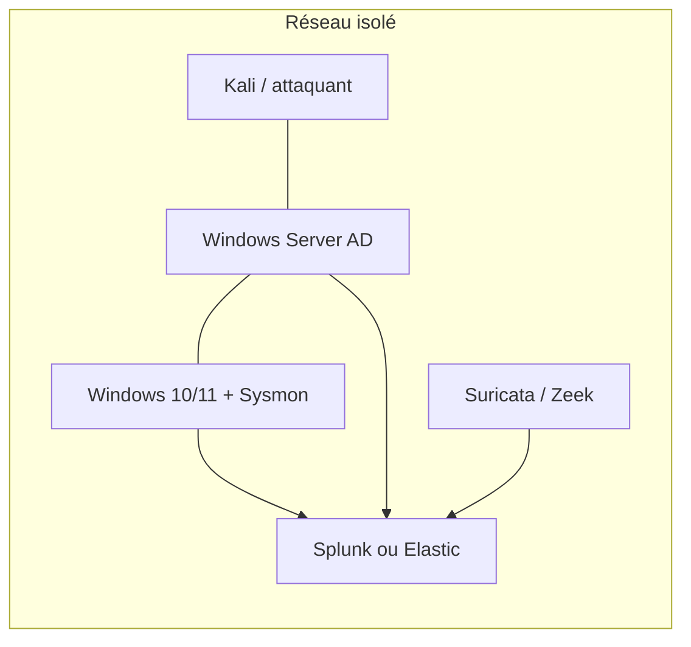

# Home lab SOC

## Architecture cible

## Composants

| Rôle | Outil | Remarque |
|---|---|---|
| Hyperviseur | VirtualBox / VMware / Proxmox | Réseau host-only ou interne |
| AD | Windows Server (évaluation) | Un domaine de test |
| Endpoint | Windows 10/11 + Sysmon | Config sysmon-modular |
| SIEM | Splunk Free ou Elastic | Un seul au début |
| Réseau | Suricata + Zeek | Port mirroring ou VM de capture |
| Attaquant | Kali + Atomic Red Team / Caldera | |

## Étapes

- [ ] Hyperviseur et réseau isolé
- [ ] AD + utilisateurs de test
- [ ] Endpoint + Sysmon + forwarder
- [ ] SIEM + ingestion validée
- [ ] Capteur réseau
- [ ] Premier test Atomic détecté de bout en bout

!!! danger "Isolation"
    Le lab ne doit jamais être relié à ton réseau domestique ou à Internet sans filtrage.
